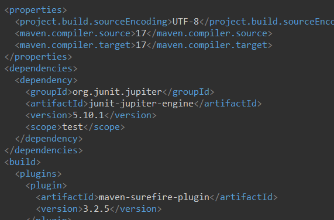

RomanNumbersKata - Ejemplo de memoria para la práctica de TDD
Nombre de los alumnos: Michel Maes Bermejo e Iván Chicano Capelo

Ejemplo 1
INPUT y OUTPUT: 1 -> "I"

EJ1. Código de test

@Test
public void testI() {
    RomanConverter converter = new RomanConverter();
    assertEquals("I", converter.convert(1));
}
EJ1. Mensaje del test añadido que NO PASA

org.opentest4j.AssertionFailedError: expected: [I] but was: []
EJ1. Código mínimo para que el test pase

Describe brevemente el código mínimo implementado

public String convert(int number){
    return "I";
}
EJ1. Captura de que TODOS los test PASAN

Pasa

EJ1. Refactorización

[BORRAR] Solo si se considera necesario

Justificar vuestra refactorización aquí.

public String convert(int number){
    return "I"; // Imaginemos que hemos refactorizado aquí
}
EJ1. Captura de que TODOS los tests PASAN tras la refactorización

[BORRAR] Solo si se ha realizado una refactorización

Pasa
