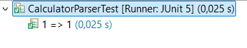

# Bowling - Práctica de TDD

Nombre de los alumnos: Ariel Carnés Blasco

### Setup de los tests

Creamos el objeto bowling para no tener que hacerlo en cada test.

```java
Bowling bowling;
	
@BeforeEach
void setup() {
	bowling = new Bowling();
}
```

## EJEMPLO 1

### No se pueden derribar menos de 0 bolos en una tirada.

**EJ1. Código de test**
```java
@Test
@DisplayName("Test pins mayor que 0")
void testPins0() {
	IllegalArgumentException ex = assertThrows(IllegalArgumentException.class, ()->bowling.throwing(-1));
	assertEquals("Number must be greater than zero", ex.getMessage());
}
```

**EJ1. Mensaje del test añadido que NO PASA**

```log
org.opentest4j.AssertionFailedError: Expected java.lang.IllegalArgumentException to be thrown, but nothing was thrown.
```

**EJ1. Código mínimo para que el test pase**

Describe brevemente el código mínimo implementado

```java
public void throwing(int pins) {
	throw new IllegalArgumentException("Number must be greater than zero");
}
```

**EJ1. Captura de que TODOS los test PASAN**



## EJEMPLO 2

### No se pueden derribar más de 10 bolos en una tirada.

**EJ2. Código de test**
```java
@Test
@DisplayName("Test pins menor que 10")
void testPins10() {
	IllegalArgumentException ex = assertThrows(IllegalArgumentException.class, ()->bowling.throwing(11));
	assertEquals("Number must be smaller than ten", ex.getMessage());
}
```

**EJ2. Mensaje del test añadido que NO PASA**

```log
org.opentest4j.AssertionFailedError: expected: <Number must be smaller than ten> but was: <Number must be greater than zero>

```

**EJ2. Código mínimo para que el test pase**

Describe brevemente el código mínimo implementado

```java
public void throwing(int pins) {
	if( pins < 0) {
		throw new IllegalArgumentException("Number must be greater than zero");
	}
	throw new IllegalArgumentException("Number must be smaller than ten");
}
```

**EJ2. Captura de que TODOS los test PASAN**


## EJEMPLO 3

### El score devuelve la suma de las tiradas anteriores (Ejemplo con tiradas que no son spare o strike).

**EJ3. Código de test**
```java
@Test
@DisplayName("Test score = tiradas anteriores")
void testGetScore() {
	bowling.throwing(4);
	bowling.throwing(5);
	bowling.throwing(0);
	bowling.throwing(2);
	assertEquals(11,bowling.getScore());
}
```

**EJ3. Mensaje del test añadido que NO PASA**

```log
java.lang.IllegalArgumentException: Number must be smaller than ten
```

**EJ3. Código mínimo para que el test pase**

Describe brevemente el código mínimo implementado

```java
public void throwing(int pins) {
	if( pins < 0) {
		throw new IllegalArgumentException("Number must be greater than zero");
	}
	if( pins > 10) {
		throw new IllegalArgumentException("Number must be smaller than ten");
	}
}

public int getScore() {
	return 11;
}
```

**EJ3. Captura de que TODOS los test PASAN**


## EJEMPLO 4

### Otro caso de tiradas para asegurarse de que el codigo se adapta.

**EJ4. Código de test**
```java
@Test
@DisplayName("Test score = tiradas anteriores(2)")
void testGetScore1() {
	bowling.throwing(3);
	bowling.throwing(3);
	bowling.throwing(1);
	bowling.throwing(7);
	assertEquals(14,bowling.getScore());
}
```

**EJ4. Mensaje del test añadido que NO PASA**

```log
org.opentest4j.AssertionFailedError: expected: <14> but was: <11>
```

**EJ4. Código mínimo para que el test pase**

Describe brevemente el código mínimo implementado

```java
private int score=0;
	
public void throwing(int pins) {
	if( pins < 0) {
		throw new IllegalArgumentException("Number must be greater than zero");
	}
	if( pins > 10) {
		throw new IllegalArgumentException("Number must be smaller than ten");
	}
	score += pins;
}

public int getScore() {
	return score;
}	
```

**EJ4. Captura de que TODOS los test PASAN**


