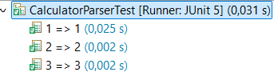
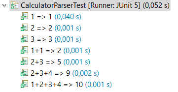
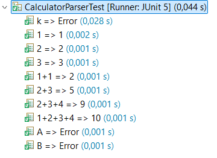

# Calculator - Práctica de TDD

Nombre del alumnos: Ariel Carnés Blasco

### Setup de los tests

Creamos el objeto calculator para no tener que hacerlo en cada test.

```java
public class CalculatorParserTest {
	
    private CalculatorParser calculator;
    
    @BeforeEach
    public void setup() {
    	calculator = new CalculatorParser();
    }
}
```

## EJEMPLO 1

### INPUT y OUTPUT: "1" => 1

**EJ1. Código de test**
```java
@Test
@DisplayName("1 => 1")
public void test1 () {
	assertEquals(1, calculator.parse("1"));
}
```

**EJ1. Mensaje del test añadido que NO PASA**

```log
java.lang.UnsupportedOperationException: Not implemented yet
```

**EJ1. Código mínimo para que el test pase**

Código para que la función devuelva 1.

```java
public int parse(String expression) {
    return 1;
}
```

**EJ1. Captura de que TODOS los test PASAN**


## EJEMPLO 2

### INPUT y OUTPUT: "2" => 2

**EJ2. Código de test**
```java
@Test
@DisplayName("2 => 2")
public void test2 () {
	assertEquals(2, calculator.parse("2"));
}
```

**EJ2. Mensaje del test añadido que NO PASA**

```log
org.opentest4j.AssertionFailedError: expected: <2> but was: <1>
```

**EJ2. Código mínimo para que el test pase**

Código para que la funcion devuelva 1 o 2 dependiendo de cada caso.

```java
if(expression == "1")return 1;
return 2;
```

**EJ2. Captura de que TODOS los test PASAN**


## EJEMPLO 3

### INPUT y OUTPUT: "3" => 3

**EJ3. Código de test**
```java
@Test
@DisplayName("3 => 3")
public void test3 () {
	assertEquals(3, calculator.parse("3"));
}
```

**EJ3. Mensaje del test añadido que NO PASA**

```log
org.opentest4j.AssertionFailedError: expected: <3> but was: <2>
```

**EJ3. Código mínimo para que el test pase**

Hacer que el programa pueda devolver un 3 cuando sea necesario.

```java
public int parse(String expression) {
	if(expression == "1")return 1;
	if(expression == "2")return 2;
	return 3;
}
```

**EJ3. Captura de que TODOS los test PASAN**



**EJ3. Refactorización**

El código es más simple si convertimos la entrada de String a Int.

```java
public int parse(String expression) {
	return Integer.parseInt(expression);
}
```

**EJ3. Captura de que TODOS los tests PASAN tras la refactorización**


## EJEMPLO 4

### INPUT y OUTPUT: "1+1" => 2

**EJ4. Código de test**
```java
@Test
@DisplayName("1+1 => 2")
public void test4 () {
	assertEquals(2, calculator.parse("1+1"));
}
```

**EJ4. Mensaje del test añadido que NO PASA**

```log
java.lang.NumberFormatException: For input string: "1+1"
```

**EJ4. Código mínimo para que el test pase**

Creo una función para determinar si la entrada es un int. Si no lo es devuelve un dos.

getScore() devolverá ese dato.

```java
private boolean isInt(String expression) {
    	try {
    		Integer.parseInt(expression);
    		return true;
    	}
    	catch(NumberFormatException ex) {
    		return false;
    	}
    }

    public int parse(String expression) {
    	if(isInt(expression))return Integer.parseInt(expression);
    	return 2;
    }
}
```

**EJ4. Captura de que TODOS los test PASAN**


## EJEMPLO 5

### INPUT y OUTPUT: "2+3" => 5

**EJ5. Código de test**
```java
@Test
@DisplayName("2+3 => 5")
public void test5 () {
	assertEquals(5, calculator.parse("2+3"));
}
```

**EJ5. Mensaje del test añadido que NO PASA**

```log
org.opentest4j.AssertionFailedError: expected: <5> but was: <2>
```

**EJ5. Código mínimo para que el test pase**

Código que devuelve la suma de los dos elementos.

```java
if(isInt(expression))return Integer.parseInt(expression);
String[] sums = expression.split("\\+");
return Integer.parseInt(sums[0])+ Integer.parseInt(sums[1]);
```

**EJ5. Captura de que TODOS los test PASAN**


## EJEMPLO 6

### INPUT y OUTPUT: "2+3+4" => 9

**EJ6. Código de test**
```java
@Test
@DisplayName("2+3+4 => 9")
public void test6 () {
	assertEquals(9, calculator.parse("2+3+4"));
}
```

**EJ6. Mensaje del test añadido que NO PASA**

```log
org.opentest4j.AssertionFailedError: expected: <9> but was: <5>
```

**EJ6. Código mínimo para que el test pase**

Si hay más de dos sumandos se devuelve 9.

```java
String[] sums = expression.split("\\+");
if(sums.length>2)return 9;
return Integer.parseInt(sums[0])+ Integer.parseInt(sums[1]);
```

**EJ6. Captura de que TODOS los test PASAN**


## EJEMPLO 7

### INPUT y OUTPUT: "1+2+3+4" => 10

**EJ7. Código de test**
```java
@Test
DisplayName("1+2+3+4 => 9")
public void test7 () {
	assertEquals(10, calculator.parse("1+2+3+4"));
}
```

**EJ7. Mensaje del test añadido que NO PASA**

```log
org.opentest4j.AssertionFailedError: expected: <10> but was: <9>
```

**EJ7. Código mínimo para que el test pase**

Si el numero de sumandos es mayor de 3 se devuelve 10

```java
String[] sums = expression.split("\\+");
if(sums.length>3)return 10;
if(sums.length>2)return 9;
return Integer.parseInt(sums[0])+ Integer.parseInt(sums[1]);
```

**EJ7. Captura de que TODOS los test PASAN**


**EJ7. Refactorización**

El código se entiende mejor si hacemos que se sumen todos los sumandos sin importar el número que haya.

```java
String[] sums = expression.split("\\+");
int res=0;

for(int i=0; i<sums.length; i++) {
	res+=Integer.parseInt(sums[i]);
}
return res;
```

**EJ7. Captura de que TODOS los tests PASAN tras la refactorización**



## EJEMPLO 8

### INPUT y OUTPUT: "A" => Error: Invalid Expression

**EJ8. Código de test**
```java
@Test
@DisplayName("A => Error")
public void test8 () {
	NumberFormatException ex = assertThrows(NumberFormatException.class,
		() -> calculator.parse("A"));
	assertEquals("Invalid expression. Use: Int (+/- Int)*",ex.getMessage());
}
```

**EJ8. Mensaje del test añadido que NO PASA**

```log
org.opentest4j.AssertionFailedError: expected: <Invalid expression. Use: Int (+/- Int)*> but was: <For input string: "A">
```

**EJ8. Código mínimo para que el test pase**

Código para lanzar el error cuando el String recibido sea "A".

```java
public int parse(String expression) {
	if(expression == "A") throw new NumberFormatException("Invalid expression. Use: Int (+/- Int)*");
	if(isInt(expression))return Integer.parseInt(expression);
	[...]
}
```

**EJ8. Captura de que TODOS los test PASAN**


## EJEMPLO 9

### INPUT y OUTPUT: "B" => Error: Invalid Expression

**EJ9. Código de test**
```java
@Test
@DisplayName("B => Error")
public void test9 () {
	NumberFormatException ex = assertThrows(NumberFormatException.class,
		() -> calculator.parse("B"));
	assertEquals("Invalid expression. Use: Int (+/- Int)*",ex.getMessage());
}
```

**EJ9. Mensaje del test añadido que NO PASA**

```log
org.opentest4j.AssertionFailedError: expected: <Invalid expression. Use: Int (+/- Int)*> but was: <For input string: "B">
```

**EJ9. Código mínimo para que el test pase**

Código para que se lance la excepción también con "B"

```java
if(expression == "A" || expression == "B") throw new NumberFormatException("Invalid expression. Use: Int (+/- Int)*");
```

**EJ9. Captura de que TODOS los test PASAN**


## EJEMPLO 10

### INPUT y OUTPUT: "k" => Error: Invalid Expression

**EJ10. Código de test**
```java
@Test
@DisplayName("k => Error")
public void test10 () {
	NumberFormatException ex = assertThrows(NumberFormatException.class,
		() -> calculator.parse("k"));
	assertEquals("Invalid expression. Use: Int (+/- Int)*",ex.getMessage());
}
```

**EJ10. Mensaje del test añadido que NO PASA**

```log
org.opentest4j.AssertionFailedError: expected: <Invalid expression. Use: Int (+/- Int)*> but was: <For input string: "k">
```

**EJ10. Código mínimo para que el test pase**

Código que también lance la excepción con "k".

```java
if(expression == "A" || expression == "B" || expression=="k") throw new NumberFormatException("Invalid expression. Use: Int (+/- Int)*");
```

**EJ10. Captura de que TODOS los test PASAN**



**EJ10. Refactorización**

Es más sencillo hacer que se lance la excepción si el String recibido es una letra.

```java
if(expression.matches("[A-Za-z]")) throw new NumberFormatException("Invalid expression. Use: Int (+/- Int)*");
```

**EJ10. Captura de que TODOS los tests PASAN tras la refactorización**


## EJEMPLO 11

### INPUT y OUTPUT: "HoLa" => Error: Invalid Expression

**EJ11. Código de test**
```java
@Test
@DisplayName("HoLa => Error")
public void test11 () {
	NumberFormatException ex = assertThrows(NumberFormatException.class,
		() -> calculator.parse("HoLa"));
	assertEquals("Invalid expression. Use: Int (+/- Int)*",ex.getMessage());
}
```

**EJ11. Mensaje del test añadido que NO PASA**

```log
org.opentest4j.AssertionFailedError: expected: <Invalid expression. Use: Int (+/- Int)*> but was: <For input string: "HoLa">
```

**EJ11. Código mínimo para que el test pase**

Código que ahora identifica letras o palabras.

```java
if(expression.matches("[A-Za-z]+")) throw new NumberFormatException("Invalid expression. Use: Int (+/- Int)*");
```

**EJ11. Captura de que TODOS los test PASAN**


## EJEMPLO 12

### INPUT y OUTPUT: "1+A" => Error: Invalid Expression

**EJ12. Código de test**
```java
@Test
@DisplayName("1+A => Error")
public void test12 () {
	NumberFormatException ex = assertThrows(NumberFormatException.class,
		() -> calculator.parse("1+A"));
	assertEquals("Invalid expression. Use: Int (+/- Int)*",ex.getMessage());
}
```

**EJ12. Mensaje del test añadido que NO PASA**

```log
org.opentest4j.AssertionFailedError: expected: <Invalid expression. Use: Int (+/- Int)*> but was: <For input string: "A">
```

**EJ12. Código mínimo para que el test pase**

Código que identifica una regla o palabra entre cualquier otro símbolo.

```java
if(expression.matches(".*[A-Za-z]+.*")) throw new NumberFormatException("Invalid expression. Use: Int (+/- Int)*");
```

**EJ12. Captura de que TODOS los test PASAN**


## EJEMPLO 13

### INPUT y OUTPUT: "5-3" => 2

**EJ13. Código de test**
```java
@Test
@DisplayName("5-3 => 2")
public void test13 () {
	assertEquals(2, calculator.parse("5-3"));
}
```

**EJ13. Mensaje del test añadido que NO PASA**

```log
java.lang.NumberFormatException: For input string: "5-3"
```

**EJ13. Código mínimo para que el test pase**

Código para que si tiene una resta devuelva 2.

```java
if(expression.matches(".*[A-Za-z]+.*")) throw new NumberFormatException("Invalid expression. Use: Int (+/- Int)*");
if(isInt(expression))return Integer.parseInt(expression);
if(expression.contains("-"))return 2;
```

**EJ13. Captura de que TODOS los test PASAN**


## EJEMPLO 14

### INPUT y OUTPUT: "1-2" => -1

**EJ14. Código de test**
```java
@Test
@DisplayName("1-2 => -1")
public void test14 () {
	assertEquals(-1, calculator.parse("1-2"));
}
```

**EJ14. Mensaje del test añadido que NO PASA**

```log
org.opentest4j.AssertionFailedError: expected: <-1> but was: <2>
```

**EJ14. Código mínimo para que el test pase**

Código que resta las dos miembros de una resta.

```java
if(expression.contains("-")) {
	String[] subs = expression.split("-");
	return Integer.parseInt(subs[0])-Integer.parseInt(subs[1]);
}
```

**EJ14. Captura de que TODOS los test PASAN**


## EJEMPLO 15

### INPUT y OUTPUT: "7-2-1" => 4

**EJ15. Código de test**
```java
@Test
@DisplayName("7-2-1 => 4")
public void test15 () {
	assertEquals(4, calculator.parse("7-2-1"));
}
```

**EJ15. Mensaje del test añadido que NO PASA**

```log
org.opentest4j.AssertionFailedError: expected: <4> but was: <5>
```

**EJ15. Código mínimo para que el test pase**

Si se restan mas de dos números se devuelve 4.

```java
if(expression.contains("-")) {
	String[] subs = expression.split("-");
	if (subs.length>2)return 4;
	return Integer.parseInt(subs[0])-Integer.parseInt(subs[1]);
}
```

**EJ15. Captura de que TODOS los test PASAN**


## EJEMPLO 16

### INPUT y OUTPUT: "9-5-3-1" => 0

**EJ16. Código de test**
```java
@Test
@DisplayName("9-5-3-1 => 0")
public void test16 () {
	assertEquals(0, calculator.parse("9-5-3-1"));
}
```

**EJ16. Mensaje del test añadido que NO PASA**

```log
org.opentest4j.AssertionFailedError: expected: <0> but was: <4>
```

**EJ16. Código mínimo para que el test pase**

Código que resta todos los números de una resta.

```java
if(expression.contains("-")) {
	String[] subs = expression.split("-");
	int res=Integer.parseInt(subs[0]);

	for(int i=1; i<subs.length; i++) {
		res-=Integer.parseInt(subs[i]);
	}
	return res;
}
```

**EJ16. Captura de que TODOS los test PASAN**


## EJEMPLO 17

### INPUT y OUTPUT: "7+1-5" => 3

**EJ17. Código de test**
```java
@Test
@DisplayName("7+1-5 => 3")
public void test17 () {
	assertEquals(3, calculator.parse("7+1-5"));
}
```

**EJ17. Mensaje del test añadido que NO PASA**

```log
java.lang.NumberFormatException: For input string: "7+1"
```

**EJ17. Código mínimo para que el test pase**

Si la expresión contiene suma y resta se devuelve un 3.

```java
if(expression.matches(".*[A-Za-z]+.*")) throw new NumberFormatException("Invalid expression. Use: Int (+/- Int)*");
if(isInt(expression))return Integer.parseInt(expression);
if(expression.contains("+") && expression.contains("-"))return 3;
```

**EJ17. Captura de que TODOS los test PASAN**


## EJEMPLO 18

### INPUT y OUTPUT: "9-5+4" => 8

**EJ18. Código de test**
```java
@Test
@DisplayName("9-5+4 => 8")
public void test18 () {
	assertEquals(8, calculator.parse("9-5+4"));
}
```

**EJ18. Mensaje del test añadido que NO PASA**

```log
org.opentest4j.AssertionFailedError: expected: <8> but was: <3>
```

**EJ18. Código mínimo para que el test pase**

Código que devuelve 8 si la primera operación no es una suma.

```java
if(expression.contains("+") && expression.contains("-")) {
	if(expression.charAt(1)=='+')return 3;
	return 8;
}
```

**EJ18. Captura de que TODOS los test PASAN**


## EJEMPLO 19

### INPUT y OUTPUT: "9+1-6-2" => 2

**EJ19. Código de test**
```java
@Test
@DisplayName("9+1-6-2 => 2")
public void test19 () {
	assertEquals(2, calculator.parse("9+1-6-2"));
}
```

**EJ19. Mensaje del test añadido que NO PASA**

```log
org.opentest4j.AssertionFailedError: expected: <2> but was: <3>
```

**EJ19. Código mínimo para que el test pase**

Código que realiza primero las restas y luego las sumas.

```java
if(expression.contains("+") && expression.contains("-")) {
	String[] sums = expression.split("\\+");
	int res=0;

	for(int i=0; i<sums.length; i++) {
		String[] subs = sums[i].split("-");
		int aux=Integer.parseInt(subs[0]);

		for(int j=1; j<subs.length; j++) {
			aux-=Integer.parseInt(subs[j]);
		}
		res+=aux;
	}
	return res;
}
```

**EJ19. Captura de que TODOS los test PASAN**


**EJ19. Refactorización**

El código nuevo que he creado me vale para Strings con solo sumas, solo restas y para solo números también. Por lo que queda un código más simple y legible si dejo sólo este código nuevo que he creado y borro todo menos la parte que lanza las excepciones.

```java
public class CalculatorParser {
    public int parse(String expression) {
    	if(expression.matches(".*[A-Za-z]+.*")) throw new NumberFormatException("Invalid expression. Use: Int (+/- Int)*");

	//El código que acabo de crear.
    	String[] sums = expression.split("\\+");
    	int res=0;
    	
    	for(int i=0; i<sums.length; i++) {
    		String[] subs = sums[i].split("-");
   			int aux=Integer.parseInt(subs[0]);
   			
    		for(int j=1; j<subs.length; j++) {
    			aux-=Integer.parseInt(subs[j]);
   			}
   			res+=aux;
   		}
   		return res;
    }
}
```

**EJ19. Captura de que TODOS los tests PASAN tras la refactorización**


## EJEMPLO 20

### INPUT y OUTPUT: "-5+9" => 4

**EJ20. Código de test**
```java
@Test
@DisplayName("-6+4-3+8 => 3")
public void test20b () {
	assertEquals(3, calculator.parse("-6+4-3+8"));
}
```

**EJ20. Mensaje del test añadido que NO PASA**

```log
org.opentest4j.AssertionFailedError: expected: <3> but was: <4>
```

**EJ20. Código mínimo para que el test pase**

Código que resta el primer número si empieza por "-".

```java
if(expression.matches(".*[A-Za-z]+.*")) throw new NumberFormatException("Invalid expression. Use: Int (+/- Int)*");
if(expression.charAt(0)=='-')return 4;
```

**EJ20. Captura de que TODOS los test PASAN**


## EJEMPLO 20B

### INPUT y OUTPUT: "-6+4-3+8" => 3

**EJ20B. Código de test**
```java
@Test
@DisplayName("-5+9 => 4")
public void test20 () {
	assertEquals(4, calculator.parse("-5+9"));
}
```

**EJ20B. Mensaje del test añadido que NO PASA**

```log
java.lang.NumberFormatException: For input string: ""
```

**EJ20B. Código mínimo para que el test pase**

Cuando el String empieza por "-" el primer subs[0] es un String vacio, por lo que nos da error al intentar pasarlo a Int. Si hacemos que equivalga a 0 básicamente estamos sustituyendo cualquier String que nos dieran por uno con un 0 al principio, solucionando el problema de que empiece con "-". Por ejemplo en este caso el String se lee como "0-6+4-3+8" en vez de "-6+4-3+8".

```java
for(int i=0; i<sums.length; i++) {
	String[] subs = sums[i].split("-");
	if(subs[0]=="")aux=0;
	else aux=Integer.parseInt(subs[0]);
	
	for(int j=1; j<subs.length; j++) {
		aux-=Integer.parseInt(subs[j]);
	}
	res+=aux;
}
```

**EJ20B. Captura de que TODOS los test PASAN**


