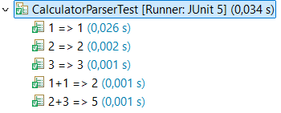

# Bowling - Práctica de TDD

Nombre de los alumnos: Ariel Carnés Blasco

### Setup de los tests

Creamos el objeto bowling para no tener que hacerlo en cada test.

```java
Bowling bowling;
	
@BeforeEach
void setup() {
	bowling = new Bowling();
}
```

## EJEMPLO 1

### No se pueden derribar menos de 0 bolos en una tirada.

**EJ1. Código de test**
```java
@Test
@DisplayName("Test pins greater than 0")
void testPins0() {
	IllegalArgumentException ex = assertThrows(IllegalArgumentException.class, ()->bowling.throwing(-1));
	assertEquals("Number must be greater than zero", ex.getMessage());
}
```

**EJ1. Mensaje del test añadido que NO PASA**

```log
org.opentest4j.AssertionFailedError: Expected java.lang.IllegalArgumentException to be thrown, but nothing was thrown.
```

**EJ1. Código mínimo para que el test pase**

Describe brevemente el código mínimo implementado

```java
public void throwing(int pins) {
	throw new IllegalArgumentException("Number must be greater than zero");
}
```

**EJ1. Captura de que TODOS los test PASAN**


## EJEMPLO 2

### No se pueden derribar más de 10 bolos en una tirada.

**EJ2. Código de test**
```java
@Test
@DisplayName("Test pins smaller than 10")
void testPins10() {
	IllegalArgumentException ex = assertThrows(IllegalArgumentException.class, ()->bowling.throwing(11));
	assertEquals("Number must be smaller than ten", ex.getMessage());
}
```

**EJ2. Mensaje del test añadido que NO PASA**

```log
org.opentest4j.AssertionFailedError: expected: <Number must be smaller than ten> but was: <Number must be greater than zero>

```

**EJ2. Código mínimo para que el test pase**

Describe brevemente el código mínimo implementado

```java
public void throwing(int pins) {
	if( pins < 0) {
		throw new IllegalArgumentException("Number must be greater than zero");
	}
	throw new IllegalArgumentException("Number must be smaller than ten");
}
```

**EJ2. Captura de que TODOS los test PASAN**


## EJEMPLO 3

### El score devuelve la suma de las tiradas anteriores (Ejemplo con tiradas que no son spare o strike).

**EJ3. Código de test**
```java
@Test
@DisplayName("Test score = sum of throws")
void testGetScore() {
	bowling.throwing(4);
	bowling.throwing(5);
	bowling.throwing(0);
	bowling.throwing(2);
	assertEquals(11,bowling.getScore());
}
```

**EJ3. Mensaje del test añadido que NO PASA**

```log
java.lang.IllegalArgumentException: Number must be smaller than ten
```

**EJ3. Código mínimo para que el test pase**

Describe brevemente el código mínimo implementado

```java
public void throwing(int pins) {
	if( pins < 0) {
		throw new IllegalArgumentException("Number must be greater than zero");
	}
	if( pins > 10) {
		throw new IllegalArgumentException("Number must be smaller than ten");
	}
}

public int getScore() {
	return 11;
}
```

**EJ3. Captura de que TODOS los test PASAN**


## EJEMPLO 4

### Otro caso de tiradas para asegurarse de que el codigo se adapta.

**EJ4. Código de test**
```java
@Test
@DisplayName("Test score = sum of throws(2)")
void testGetScore1() {
	bowling.throwing(3);
	bowling.throwing(3);
	bowling.throwing(1);
	bowling.throwing(7);
	assertEquals(14,bowling.getScore());
}
```

**EJ4. Mensaje del test añadido que NO PASA**

```log
org.opentest4j.AssertionFailedError: expected: <14> but was: <11>
```

**EJ4. Código mínimo para que el test pase**

Describe brevemente el código mínimo implementado

```java
private int score=0;
	
public void throwing(int pins) {
	if( pins < 0) {
		throw new IllegalArgumentException("Number must be greater than zero");
	}
	if( pins > 10) {
		throw new IllegalArgumentException("Number must be smaller than ten");
	}
	score += pins;
}

public int getScore() {
	return score;
}	
```

**EJ4. Captura de que TODOS los test PASAN**


## EJEMPLO 5

### En un turno (2 tiradas) no se pueden derribar más de 10 bolos.

**EJ5. Código de test**
```java
@Test
@DisplayName("Pins in a turn <= 10")
void testPinsPerThrow() {
	bowling.throwing(9);
	IllegalArgumentException ex = assertThrows(IllegalArgumentException.class,() -> bowling.throwing(9));
	assertEquals("You cant throw more than 10 pins per turn",ex.getMessage());
}
```

**EJ5. Mensaje del test añadido que NO PASA**

```log
org.opentest4j.AssertionFailedError: Expected java.lang.IllegalArgumentException to be thrown, but nothing was thrown.
```

**EJ5. Código mínimo para que el test pase**

Describe brevemente el código mínimo implementado

```java
private int previousThrow=0;
	
public void throwing(int pins) {
	[...]
	if(previousThrow+pins>10) {
		throw new IllegalArgumentException("You cant throw more than 10 pins per turn");
	}
	
	score += pins;
	previousThrow = pins;
}
```

**EJ5. Captura de que TODOS los test PASAN**



## EJEMPLO 6

### Dos tiradas seguidas puedan superar 10 si es cada una en un turno diferente.

**EJ6. Código de test**
```java
@Test
@DisplayName("Test change of turns")
void testChangeOfTurns() {
	bowling.throwing(0);
	bowling.throwing(8);
	bowling.throwing(9);
	assertEquals(17,bowling.getScore());
}
```

**EJ6. Mensaje del test añadido que NO PASA**

```log
java.lang.IllegalArgumentException: You cant throw more than 10 pins per turn
```

**EJ6. Código mínimo para que el test pase**

Describe brevemente el código mínimo implementado

```java
private int turn = 0;
	
public void throwing(int pins) {
	[...]
	if(turn ==1 && previousThrow+pins>10) {
		throw new IllegalArgumentException("You cant throw more than 10 pins per turn");
	}
	
	score += pins;
	previousThrow = pins;

	turn++;
	turn%=2;
}
```

**EJ6. Captura de que TODOS los test PASAN**


## EJEMPLO 7

### Si en el segundo tiro del turno se derriban los bolos que quedan es spare y la puntuacion del siguiente tiro se suma.

**EJ7. Código de test**
```java
@Test
@DisplayName("Test spare")
void testSpare() {
	bowling.throwing(3);
	bowling.throwing(7);
	bowling.throwing(5);
	bowling.throwing(5);
	bowling.throwing(2);
	bowling.throwing(1);
	bowling.throwing(3);
	bowling.throwing(4);
	assertEquals(43,bowling.getScore());
}
```

**EJ7. Mensaje del test añadido que NO PASA**

```log
org.opentest4j.AssertionFailedError: expected: <43> but was: <30>
```

**EJ7. Código mínimo para que el test pase**

Describe brevemente el código mínimo implementado

```java
	private boolean spare = false;
	
	public void throwing(int pins) {
		[...]
		//Sum score
		score += pins;
		if(spare) {
			score+=pins;
			//Deactivate spare
			if(turn == 1) {
				spare = false;
			}
		}
		
		//Check for spare
		if(turn == 1 && previousThrow + pins == 10) {
			spare = true;
		}
		
		//Change turn
		turn++;
		turn%=2;
		previousThrow = pins;
	}
```

**EJ7. Captura de que TODOS los test PASAN**


**EJ7. Refactorización**

El código es poco legible y se puede reorganizar para que se entienda y funcione mejor.
La idea es hacerlo separando lo que pasa en cada turno.

```java
public void throwing(int pins) {
	if( pins < 0) {
		throw new IllegalArgumentException("Number must be greater than zero");
	}
	if( pins > 10) {
		throw new IllegalArgumentException("Number must be smaller than ten");
	}
	
	//Any throw
	
	//Sum score
	score += pins;
	if(spare)  {
		score += pins;
	}

	//Second throw
	if(turn == 1) {
		if( pins + previousThrow > 10) {
			throw new IllegalArgumentException("You cant throw more than 10 pins per turn");
		}
		
		//Disable spare bonus
		spare = false;

		//Check for spare
		if(pins + previousThrow == 10) {
			spare = true;
		}
	}
	
	//Change turn
	turn++;
	turn%=2;
	previousThrow = pins;
}
```

**EJ1. Captura de que TODOS los tests PASAN tras la refactorización**


