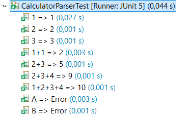
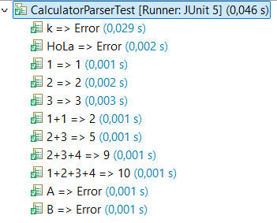

# Bowling - Práctica de TDD

Nombre de los alumnos: Ariel Carnés Blasco

### Setup de los tests

Creamos el objeto bowling para no tener que hacerlo en cada test.

```java
Bowling bowling;
	
@BeforeEach
void setup() {
	bowling = new Bowling();
}
```

## EJEMPLO 1

### No se pueden derribar menos de 0 bolos en una tirada.

**EJ1. Código de test**
```java
@Test
@DisplayName("Test pins greater than 0")
void testPins0() {
	IllegalArgumentException ex = assertThrows(IllegalArgumentException.class, ()->bowling.throwing(-1));
	assertEquals("Number must be greater than zero", ex.getMessage());
}
```

**EJ1. Mensaje del test añadido que NO PASA**

```log
org.opentest4j.AssertionFailedError: Expected java.lang.IllegalArgumentException to be thrown, but nothing was thrown.
```

**EJ1. Código mínimo para que el test pase**

El código minimo necesario para el test es que la función a la que llama lanze la excepción que desee.

```java
public void throwing(int pins) {
	throw new IllegalArgumentException("Number must be greater than zero");
}
```

**EJ1. Captura de que TODOS los test PASAN**


## EJEMPLO 2

### No se pueden derribar más de 10 bolos en una tirada.

**EJ2. Código de test**
```java
@Test
@DisplayName("Test pins smaller than 10")
void testPins10() {
	IllegalArgumentException ex = assertThrows(IllegalArgumentException.class, ()->bowling.throwing(11));
	assertEquals("Number must be smaller than ten", ex.getMessage());
}
```

**EJ2. Mensaje del test añadido que NO PASA**

```log
org.opentest4j.AssertionFailedError: expected: <Number must be smaller than ten> but was: <Number must be greater than zero>
```

**EJ2. Código mínimo para que el test pase**

Ahora la función deberá lanzar una excepción u la otra dependiendo de ciertas condiciones para que ambos tests sean ciertos.

```java
public void throwing(int pins) {
	if( pins < 0) {
		throw new IllegalArgumentException("Number must be greater than zero");
	}
	throw new IllegalArgumentException("Number must be smaller than ten");
}
```

**EJ2. Captura de que TODOS los test PASAN**


## EJEMPLO 3

### El score devuelve la suma de las tiradas anteriores (Ejemplo con tiradas que no son spare o strike).

**EJ3. Código de test**
```java
@Test
@DisplayName("Test score = sum of throws")
void testGetScore() {
	bowling.throwing(4);
	bowling.throwing(5);
	bowling.throwing(0);
	bowling.throwing(2);
	assertEquals(11,bowling.getScore());
}
```

**EJ3. Mensaje del test añadido que NO PASA**

```log
java.lang.IllegalArgumentException: Number must be smaller than ten
```

**EJ3. Código mínimo para que el test pase**

Para poder completar el test no se puede lanzar ninguna excepción por lo que ambas tendrán que lanzarse sólo si se llevan a cabo ciertas condiciones.

getScore() devolverá 11 así contenta al test de la forma más simple.

```java
public void throwing(int pins) {
	if( pins < 0) {
		throw new IllegalArgumentException("Number must be greater than zero");
	}
	if( pins > 10) {
		throw new IllegalArgumentException("Number must be smaller than ten");
	}
}

public int getScore() {
	return 11;
}
```

**EJ3. Captura de que TODOS los test PASAN**


## EJEMPLO 4

### Otro caso de tiradas para asegurarse de que el codigo se adapta.

**EJ4. Código de test**
```java
@Test
@DisplayName("Test score = sum of throws(2)")
void testGetScore1() {
	bowling.throwing(3);
	bowling.throwing(3);
	bowling.throwing(1);
	bowling.throwing(7);
	assertEquals(14,bowling.getScore());
}
```

**EJ4. Mensaje del test añadido que NO PASA**

```log
org.opentest4j.AssertionFailedError: expected: <14> but was: <11>
```

**EJ4. Código mínimo para que el test pase**

Ahora que el test nos obliga a dar diferentes resultados dependiendo de los datos que proporciona tenemos que modificar la clase para que almacene la puntuación que serán los bolos tirados acumulados con throwing.

getScore() devolverá ese dato.

```java
private int score=0;
	
public void throwing(int pins) {
	if( pins < 0) {
		throw new IllegalArgumentException("Number must be greater than zero");
	}
	if( pins > 10) {
		throw new IllegalArgumentException("Number must be smaller than ten");
	}
	score += pins;
}

public int getScore() {
	return score;
}	
```

**EJ4. Captura de que TODOS los test PASAN**


## EJEMPLO 5

### En un turno (2 tiradas) no se pueden derribar más de 10 bolos.

**EJ5. Código de test**
```java
@Test
@DisplayName("Pins in a turn <= 10")
void testPinsPerThrow() {
	bowling.throwing(9);
	IllegalArgumentException ex = assertThrows(IllegalArgumentException.class,() -> bowling.throwing(9));
	assertEquals("You cant throw more than 10 pins per turn",ex.getMessage());
}
```

**EJ5. Mensaje del test añadido que NO PASA**

```log
org.opentest4j.AssertionFailedError: Expected java.lang.IllegalArgumentException to be thrown, but nothing was thrown.
```

**EJ5. Código mínimo para que el test pase**

Para que salte la excepción en el test estableceremos que se guarde el valor de los bolos tirados el turno anterior y si ambos suman más de diez saltará la excepción.

```java
private int previousThrow=0;
	
public void throwing(int pins) {
	[...]
	if(previousThrow+pins>10) {
		throw new IllegalArgumentException("You cant throw more than 10 pins per turn");
	}
	
	score += pins;
	previousThrow = pins;
}
```

**EJ5. Captura de que TODOS los test PASAN**


## EJEMPLO 6

### Dos tiradas seguidas puedan superar 10 si es cada una en un turno diferente.

**EJ6. Código de test**
```java
@Test
@DisplayName("Test change of turns")
void testChangeOfTurns() {
	bowling.throwing(0);
	bowling.throwing(8);
	bowling.throwing(9);
	assertEquals(17,bowling.getScore());
}
```

**EJ6. Mensaje del test añadido que NO PASA**

```log
java.lang.IllegalArgumentException: You cant throw more than 10 pins per turn
```

**EJ6. Código mínimo para que el test pase**

Crearemos un sistema de turnos, el 0 es la primera tirada, y el 1 la segunda. Si en el segundo turno se ve que se han tirado más de 10 bolos saltará la excepción.

```java
private int turn = 0;
	
public void throwing(int pins) {
	[...]
	if(turn ==1 && previousThrow+pins>10) {
		throw new IllegalArgumentException("You cant throw more than 10 pins per turn");
	}
	
	score += pins;
	previousThrow = pins;

	turn++;
	turn%=2;
}
```

**EJ6. Captura de que TODOS los test PASAN**


## EJEMPLO 7

### Si en el segundo tiro del turno se derriban los bolos que quedan es spare y la puntuacion del siguiente turno se suma.

**EJ7. Código de test**
```java
@Test
@DisplayName("Test spare")
void testSpare() {
	bowling.throwing(3);
	bowling.throwing(7);
	bowling.throwing(5);
	bowling.throwing(5);
	bowling.throwing(2);
	bowling.throwing(1);
	bowling.throwing(3);
	bowling.throwing(4);
	assertEquals(43,bowling.getScore());
}
```

**EJ7. Mensaje del test añadido que NO PASA**

```log
org.opentest4j.AssertionFailedError: expected: <43> but was: <30>
```

**EJ7. Código mínimo para que el test pase**

En el test hay un spare sucedido de otro, este está sucedido de un tiro normal y termina con otro. Haciendo que nuestro código funcione para el test conseguiremos que funcione en casos en los que pase esto.

Creamos una comprobación para que cuando esté en la segunda tirada y haya tirado los 10 bolos se guarde que la siguiente puntuacion es bonus en el booleano spare. cuando este activado la puntuación se sumara de nuevo como bonus del tiro anterior y si se está terminando el turno (en la segunda tirada) se declarará que ya se ha cumplido el bonus.

```java
	private boolean spare = false;
	
	public void throwing(int pins) {
		[...]
		//Sum score
		score += pins;
		if(spare) {
			score+=pins;
			//Deactivate spare
			if(turn == 1) {
				spare = false;
			}
		}
		
		//Check for spare
		if(turn == 1 && previousThrow + pins == 10) {
			spare = true;
		}
		
		//Change turn
		turn++;
		turn%=2;
		previousThrow = pins;
	}
```

**EJ7. Captura de que TODOS los test PASAN**


**EJ7. Refactorización**

El código es poco legible y se puede reorganizar para que se entienda y funcione mejor.

La idea es hacerlo separando lo que pasa en cada turno.

```java
public void throwing(int pins) {
	if( pins < 0) {
		throw new IllegalArgumentException("Number must be greater than zero");
	}
	if( pins > 10) {
		throw new IllegalArgumentException("Number must be smaller than ten");
	}
	
	//Any throw
	
	//Sum score
	score += pins;
	if(spare)  {
		score += pins;
	}

	//Second throw
	if(turn == 1) {
		if( pins + previousThrow > 10) {
			throw new IllegalArgumentException("You cant throw more than 10 pins per turn");
		}
		
		//Disable spare bonus
		spare = false;

		//Check for spare
		if(pins + previousThrow == 10) {
			spare = true;
		}
	}
	
	//Change turn
	turn++;
	turn%=2;
	previousThrow = pins;
}
```

**EJ7. Captura de que TODOS los tests PASAN tras la refactorización**


## EJEMPLO 8

### Si se derriban 10 bolos en la primera tirada se considera un strike y la puntuacion de los siguientes dos turnos se suman a la de este.

**EJ8. Código de test**
```java
@Test
@DisplayName("Test strike")
void testStrike() {
	bowling.throwing(3);
	bowling.throwing(7);
	bowling.throwing(10);
	bowling.throwing(10);
	bowling.throwing(5);
	bowling.throwing(5);
	bowling.throwing(10);
	bowling.throwing(3);
	bowling.throwing(4);
	bowling.throwing(2);
	bowling.throwing(1);
	bowling.throwing(10);
	bowling.throwing(4);
	bowling.throwing(0);
	bowling.throwing(2);
	bowling.throwing(1);
	assertEquals(154,bowling.getScore());
}
```

**EJ8. Mensaje del test añadido que NO PASA**

```log
java.lang.IllegalArgumentException: You cant throw more than 10 pins per turn
```

**EJ8. Código mínimo para que el test pase**

De nuevo en el test se presentan varios plenos en condiciones distintas por lo que el código se tendrá que adaptar a todas. strike1 simbolizará el primer turno de bonus de un strike, y strike2 el segundo.

Se comprueba si es la primera tirada del turno y se tiran 10 bolos se considera strike por lo que se maneja como final de turno y se tienen que deshabilitar los bonus para que no se cuenten en los siguientes turnos. También turn coge el valor de 3 para volverse impar y con el calculo de cambio de turno, el siguiente turno vuelva a ser turno 0.

El bonus de strike se maneja de la siguiente forma. Si hay un strike, se declarará el bonus de strike1, y al terminar el turno siguiente este bonus se quitará, pero tiene que indicar que sigue habiendo bonus strike2. De esta forma si hay varios strikes seguidos cada cual podrá llevar a cabo sus bonuses.

```java
private boolean strike1 = false, strike2 = false;

public void throwing(int pins) {
	[...]
	//Sum score
	score += pins;
	if(spare)  {
		score += pins;
	}
	if(strike2) {
		score += pins;
		if(turn == 1) {
			strike2 = false;
		}
	}
	if(strike1) {
		score += pins;
		if(turn == 1) {
			strike2 = true;
			strike1 = false;
		}
	}
	//First throw
	if(turn == 0) {
			
		//Check strike
		if(pins == 10) {
			
			//Disable bonus
			spare = false;
			strike2 = false;

			if(strike1) {
				strike2 = true;
			}
			else {
				strike1 = true;
			}
			
			turn = 3;
		}
	}
	[...]
}
```

**EJ8. Captura de que TODOS los test PASAN**


**EJ8. Refactorización**

El código es poco legible de nuevo y se puede reorganizar para que se entienda y funcione mejor.

La forma de hacerlo es meter la desactivación del bonus de strike en el segundo turno. También nos ahorramos una comparación si el segundo turno es un else del primero.

```java
public void throwing(int pins) {
	[...]
	//Any throw
		
	//Sum score
	score += pins;
	if(spare)  {
		score += pins;
	}
	if(strike2) {
		score += pins;
	}
	if(strike1) {
		score += pins;
	}

	//First throw
	if(turn == 0) {
		[...]
	}
	//Second throw
	else {
		if( pins + previousThrow > 10) {
			throw new IllegalArgumentException("You cant throw more than 10 pins per turn");
		}
		
		//Disable bonus
		spare = false;
		if(strike1) {
			strike2 = true;
		}
		else {
			strike2 = false;
		}
		strike1 = false;
		
		//Check for spare
		if(pins + previousThrow == 10) {
			spare = true;
		}
	}
	[...]
}
```

**EJ8. Captura de que TODOS los tests PASAN tras la refactorización**


## EJEMPLO 9

### Si en el décimo turno se consigue un spare, el bonus serán los bolos derribados en una tirada extra.

**EJ9. Código de test**
```java
@Test
@DisplayName("Test ending spare")
void testEndingSpare() {
	bowling.throwing(10);
	for(int i = 0;i<16;i++) {
		bowling.throwing(0);
	}
	bowling.throwing(5);
	bowling.throwing(5);
	bowling.throwing(7);
	assertEquals(27,bowling.getScore());
}
```

**EJ9. Mensaje del test añadido que NO PASA**

```log
org.opentest4j.AssertionFailedError: expected: <27> but was: <34>
```

**EJ9. Código mínimo para que el test pase**

Para empezar necesitamos llevar cuenta de los turnos. Los guardaremos en frame. Además, al haber un strike en el test, tenemos que asegurarnos también de que los strikes cuentan como turno.

Se incrementará el turno cada segunda tirada de un turno y si se hace un strike.

Lo siguiente es asegurarse de que el tiro bonus se ejecuta como bonus y no cuenta como tiro en sí.

Cuando hay un spare comprobamos si es el turno 10, y si lo es declaramos que hay una tirada de bonus en el booleano finalBonus. La puntuación de la tirada bonus son los bolos que se tiran en la tirada, de forma que se asegura que no aplica ningún bonus anterior en la puntuación.

```java
private int frame = 1;
private boolean finalBonus = false;
	
public void throwing(int pins) {
	[...]

	//Sum score
	score += pins;
	if(!finalBonus) {
		if(spare)  {
			score += pins;
		}
		if(strike2) {
			score += pins;
		}
		if(strike1) {
			score += pins;
		}
	}

	//First throw
	if(turn == 0) {

		//Check strike
		if(pins == 10) {
			[...]
			//Pass Frame
			turn++;
			frame++;
		}
	}

	//Second throw
	else {
		[...]

		//Check for spare
		if(pins + previousThrow == 10) {
			spare = true;
			if(frame == 10) {
				finalBonus = true;
			}
		}
		
		//Pass frame
		frame++;
	}
	[...]
}
```

**EJ9. Captura de que TODOS los test PASAN**



## EJEMPLO 10

### Si en el décimo turno se consigue un strike, el bonus serán los bolos derribados en dos tiradas extra.

**EJ10. Código de test**
```java
@Test
@DisplayName("Test ending strike")
void testEndingStrike() {
	for(int i = 0;i<18;i++) {
		bowling.throwing(0);
	}
	bowling.throwing(10);
	bowling.throwing(4);
	bowling.throwing(5);
	assertEquals(19,bowling.getScore());
}
```

**EJ10. Mensaje del test añadido que NO PASA**

```log
org.opentest4j.AssertionFailedError: expected: <19> but was: <28>
```

**EJ10. Código mínimo para que el test pase**

Para que se cumpla el test basta con comprobar si cuando hay un strike es en el décimo turno y si es así, declarar que los siguientes tiros son bonus con la variable que tenemos de antes.

```java
public void throwing(int pins) {
	[...]
	//First throw
	if(turn == 0) {
		
		//Check strike
		if(pins == 10) {
			
			//Disable bonus
			spare = false;
			strike2 = false;

			if(strike1) {
				strike2 = true;
			}
			strike1 = true;
			
			//Last turn
			if(frame == 10) {
				finalBonus = true;
			}
			
			//Pass Frame
			turn++;
			frame++;
		}
	}
	[...]
}
```

**EJ10. Captura de que TODOS los test PASAN**


## EJEMPLO 11

### El juego terminará en el décimo turno.

**EJ11. Código de test**
```java
@Test
@DisplayName("Test game ends")
void testEnds() {
	for(int i = 0;i<20;i++) {
		bowling.throwing(0);
	}
	IndexOutOfBoundsException ex = assertThrows(IndexOutOfBoundsException.class,() -> bowling.throwing(0));
	assertEquals("The game has finished, you cant throw anymore.",ex.getMessage());
}
```

**EJ11. Mensaje del test añadido que NO PASA**

```log
org.opentest4j.AssertionFailedError: Expected java.lang.IndexOutOfBoundsException to be thrown, but nothing was thrown.
```

**EJ11. Código mínimo para que el test pase**

Bastaría con comprarar antes de nada si el turno es mayor que 10 y si es así lanzar la excepción requerida, pero entonces los testsde bonus no funcionarían ya que no hay nada que controle que el turno no avance en las jugadas bonus.

De modo que incluiremos la comparación que lanza la excepción lo primero. Lo siguiente es que en los tiros bonus se reste el turno así nunca llega a superar 10 y los otros tests serían correctos también.

```java
public void throwing(int pins) {
	[...]
	if(frame > 10) {
		throw new IndexOutOfBoundsException("The game has finished, you cant throw anymore.");
	}
	//Sum score
	score += pins;
	if(!finalBonus) {
		[...]
	}
	else{
		frame--;
	}

	//First throw
	if(turn == 0) {
		
		//Check strike
		if(pins == 10) {
			[...]
			//Last turn
			if(frame == 10) {
				finalBonus = true;
				frame--;
			}
			
			//Pass Frame
			turn++;
			frame++;
		}
	}
	
	//Second throw
	else {
		[...]
		if(pins + previousThrow == 10) {
			spare = true;
			
			//Last turn
			if(frame == 10) {
				finalBonus = true;
				frame--;
			}
		}
		
		//Pass frame
		frame++;
	}
	[...]
}
```

**EJ11. Captura de que TODOS los test PASAN**



## EJEMPLO 12

### El juego terminará en el décimo turno tras el bonus de spare.

**EJ12. Código de test**
```java
@Test
@DisplayName("Test game ends Spare bonus")
void testEndsSpare() {
	for(int i = 0;i<18;i++) {
		bowling.throwing(0);
	}
	bowling.throwing(5);
	bowling.throwing(5);
	bowling.throwing(0);
	IndexOutOfBoundsException ex = assertThrows(IndexOutOfBoundsException.class,() -> bowling.throwing(0));
	assertEquals("The game has finished, you cant throw anymore.",ex.getMessage());
}
```

**EJ12. Mensaje del test añadido que NO PASA**

```log
org.opentest4j.AssertionFailedError: Expected java.lang.IndexOutOfBoundsException to be thrown, but nothing was thrown.
```

**EJ12. Código mínimo para que el test pase**

Tenemos que cambiar la modificación de antes para que en los tiros de bonus se sumen turnos en vez de quitarlos. En la comprobación de spare no tenemos que cambiar nada ya que antes lo habíamos modificado ya para que se restara un turno al ser bonus, y con sumar otro turno en el tiro bonus tenemos el número de turnos que necesitamos. En cambio, tenemos que cambiar la comprobación de bonus de strike porque restándole un solo turno no llega a los turnos necesarios para que funcione el test de bonus de strike.

```java
public void throwing(int pins) {
	[...]
	//Sum score
	score += pins;
	if(!finalBonus) {
		[...]
	}
	else{
		frame++;
	}

	//First throw
	if(turn == 0) {
		
		//Check strike
		if(pins == 10) {
			[...]
			//Last turn
			if(frame == 10) {
				finalBonus = true;
				frame=0;
			}
			[...]
		}
	}
	[...]
}
```

**EJ12. Captura de que TODOS los test PASAN**


## EJEMPLO 13

### El juego terminará en el décimo turno tras el bonus de strike.

**EJ13. Código de test**
```java
@Test
@DisplayName("Test game ends Strike bonus")
void testEndsStrike() {
	for(int i = 0;i<18;i++) {
		bowling.throwing(0);
	}
	bowling.throwing(10);
	bowling.throwing(0);
	bowling.throwing(10);
	IndexOutOfBoundsException ex = assertThrows(IndexOutOfBoundsException.class,() -> bowling.throwing(0));
	assertEquals("The game has finished, you cant throw anymore.",ex.getMessage());
}
```

**EJ13. Mensaje del test añadido que NO PASA**

```log
org.opentest4j.AssertionFailedError: Expected java.lang.IndexOutOfBoundsException to be thrown, but nothing was thrown.
```

**EJ13. Código mínimo para que el test pase**

Para que se pueda ejecutar con el número justo de turnos tendremos que restarle dos al comprobar que hay strike en el décimo turno. Como lo teníamos antes que le restaba un solo turno o todos se quedaba corto de turnos o se pasaba.

```java
public void throwing(int pins) {
	[...]
	//First throw
	if(turn == 0) {
		
		//Check strike
		if(pins == 10) {
			[...]
			//Last turn
			if(frame == 10) {
				finalStrike = true;
				frame-=2;
			}
			
			//Pass Frame
			turn++;
			frame++;
		}
	}
	[...]
}
```

**EJ13. Captura de que TODOS los test PASAN**


